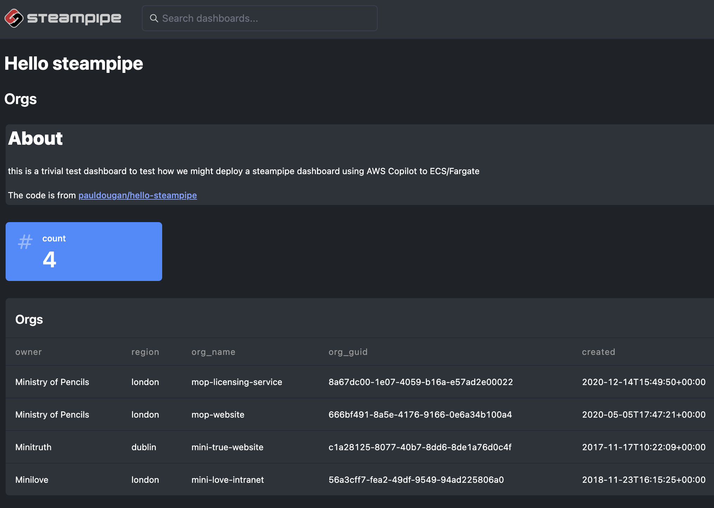

# hello-steampipe



run a minimal [Steampipe](https://steampipe.io) dashboard on AWS using [AWS Copilot CLI](https://aws.github.io/copilot-cli/) to explore our options for deployment

# Deployment options

- the option to deploy using apprunner using the [`Request-Driven Web Service`](https://aws.github.io/copilot-cli/docs/concepts/services/#request-driven-web-service) approach does not work because of the need to use web sockets, we were able to see the landing page but were unable to render the dashboard
- we deployed the app from the dockerfile using [`Load Balanced Web Service`](https://aws.github.io/copilot-cli/docs/concepts/services/#load-balanced-web-service) and confirmed that it deploys to ECS with fargate

# key steps in using copilot


```
# assume role into paas-experimenta account

gds aws paas-experiments-admin -- $SHELL

# setup app

copilot app init hello-steampipe

# configure environments 
copilot env init -n dev
copilot env init -n staging

# deploy environment 
copilot env deploy -n dev

# configure backend dashboard 
copilot svc init -d steampipe/Dockerfile -n dashboard -t 
"Backend Service"

# deploy back end dashboard
copilot svc deploy -e dev -n dashboard

# configure front end nginx 
copilot svc init -d nginx/Dockerfile -n nginx -t "Load Balanced Web Service"

# deploy feont end nginx
copilot svc deploy -e dev -n nginx

# check service 
copilot svc status

# list environmenta 
copilot env ls

# hop into thr nginx container
copilot svc exec -n nginx -c /bin/bash

# view logs
copilot svc logs -n dashboard

```

# Screencasts

- [01-app-init](docs/images/01-app-init)
- [02-env-init](docs/images/02-env-init)
- [03-env-deploy](docs/images/03-env-deploy)
- [04-svc-init-dashboard](docs/images/04-svc-init-dashboard)
- [05-svc-deploy-dashboard](docs/images/05-svc-deploy-dashboard)
- [06-svc-init-nginx](docs/images/06-svc-init-nginx)
- [07-svc-deploy-nginx](docs/images/07-svc-deploy-nginx)

